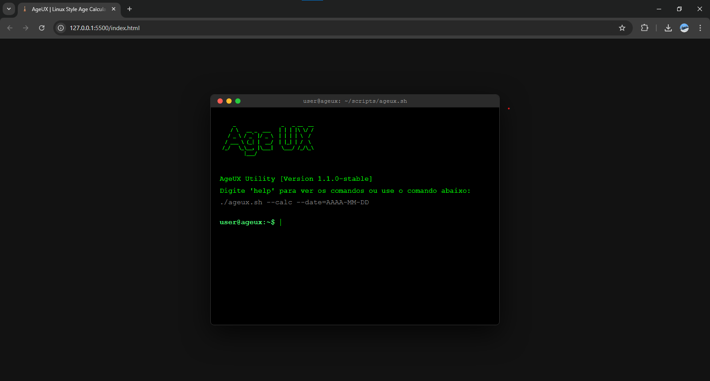
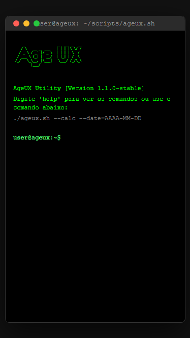

# AgeUX - Calculadora de Idade em Terminal

Este repositório contém o código-fonte do AgeUX, um utilitário desenvolvido para simular uma interface de linha de comando Linux (Bash) dedicada ao cálculo de idade. O projeto foi estruturado com foco em imersão, lógica assíncrona e design responsivo.

## Visão Geral

O AgeUX funciona como um simulador de terminal técnico. A arquitetura foi planejada para proporcionar uma experiência de usuário (UX) diferenciada, utilizando comandos manuais e simulações de processos do sistema (como carregamento de repositórios) em vez de formulários convencionais.

---

## Arquitetura de Pastas

A organização do diretório segue o padrão de separação de responsabilidades:

* **Raiz:** Arquivos de configuração global, SEO e entrada principal (`index.html`).
* **assets/css:** Estilização modular com suporte a temas retro e responsividade.
* **assets/js:** Motor lógico do sistema, interpretador de comandos e funções de tempo.
* **assets/imgs:** Armazenamento de ativos estáticos e recursos visuais (previews).

---

## Especificações Técnicas

O desenvolvimento foi realizado utilizando tecnologias nativas, priorizando o desempenho e a compatibilidade:

* **Estrutura:** HTML5 Semântico com foco em acessibilidade.
* **Estilização:** CSS3 puro com suporte a *Ghost Suggestions* e *Media Queries*.
* **Comportamento:** JavaScript ES6+ com processamento de comandos assíncronos.
* **Indexação:** Configurações de metadados e SEO para otimização de busca.

---

## Demonstração da Interface

### Interface Desktop



### Interface Mobile



---

## Procedimentos de Instalação

Para replicar o ambiente de desenvolvimento localmente, siga os passos abaixo:

1. Clone o repositório:

```bash
git clone [https://github.com/JoseIzataQuinvula/ageux.git](https://github.com/JoseIzataQuinvula/ageux.git)

cd ageux

2. Execução: O projeto não requer compiladores. Basta abrir o arquivo index.html em um navegador moderno ou utilizar o Live Server.
